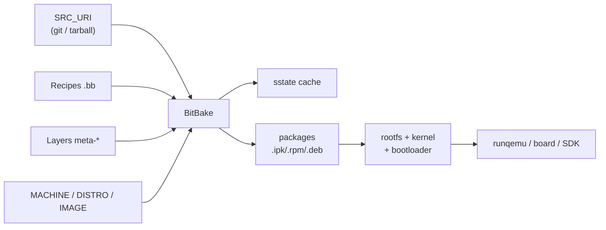

# Yocto lab

Learning what the Yocto Project is and building something with it from this Mac.

Source: <https://docs.yoctoproject.org/brief-yoctoprojectqs/index.html>

## What Yocto is (in one paragraph)

Yocto Project is not a distribution — it is a **metadata + build engine** for
producing your own custom Linux distribution from source, for a specific board.
The reference distribution used for learning is **Poky**. You describe *what* you
want (recipes, layers, machine, distro, image) and BitBake figures out *how* to
fetch, cross-compile, package and assemble it.

## Core vocabulary

| Term | Meaning |
|------|---------|
| **BitBake** | task executor (like `make`, but metadata-driven). Runs the build. |
| **Recipe (`.bb`)** | how to fetch/build/install one package: source URI, version, deps. |
| **`.bbclass`** | shared build logic reused by recipes (`autotools`, `cmake`, `systemd`...). |
| **Layer (`meta-*`)** | a repo of related recipes + config; modularity unit. |
| **`bblayers.conf`** | list of layers the build uses. |
| **MACHINE** | target hardware (`qemuarm64`, `qemux86-64`, `raspberrypi5`...). |
| **DISTRO** | distro policy: init system (sysvinit/systemd), libc, features. |
| **IMAGE** | an image recipe assembling a rootfs (`core-image-minimal`, `core-image-sato`). |
| **BSP layer** | board support package layer for real hardware. |
| **OpenEmbedded (OE)** | the metadata/build framework Yocto is built on. Poky = OE-core ref distro. |
| **sstate cache** | shared-state cache of previous task outputs → fast incremental rebuilds. |

## The build pipeline



## Two workflows

1. **Classic** (still the most documented):
   ```
   git clone -b scarthgap https://git.yoctoproject.org/poky
   cd poky && source oe-init-build-env
   bitbake core-image-minimal
   runqemu qemuarm64
   ```
2. **New `bitbake-setup`** (what the 6.0-tip quickstart now recommends):
   ```
   python3 -m venv ./bitbake-setup-venv && . ./bitbake-setup-venv/bin/activate
   pip install bitbake-setup
   bitbake-setup init            # interactive: config + MACHINE + DISTRO
   source poky-master/build/init-build-env
   bitbake core-image-sato
   ```
   Note: the docs are for 6.0 ("wrynose"), which has **no branch yet** on
   git.yoctoproject.org as of 2026-10-06 — only `master`, `walnascar` (5.2),
   `scarthgap` (LTS). So we use the classic flow with `scarthgap`.

## Why this runs in a VM on this Mac

- Yocto's build host must be **Linux** (macOS is not supported).
- Yocto requires a **case-sensitive filesystem**; macOS APFS is case-insensitive
  by default. A Linux VM/container side-steps both issues.

## This machine (measured 2026-10-06)

- Host: macOS 26.6.2, arm64 (M-series), 8 CPU, **16 GB RAM**, ~21 GB free on `/`.
- Yocto recommends ≥140 GB disk and ≥32 GB RAM. We are well under → **disk-bound**.
- colima VM (already present): aarch64, macOS Virtualization.Framework, docker
  runtime, **17 GB free** inside. Full `core-image-minimal` will likely not fit;
  a single small recipe will.

See [runbook.md](runbook.md) for the exact commands and
[../plans/yocto-lab.md](../plans/yocto-lab.md) for the plan/checklist.

## First build (works)

`bitbake zlib-native` — 25 tasks, all succeeded, **3m41s**. Produced
`tmp/work/aarch64-linux/zlib-native/1.3.1/image/.../libz.so.1.3.1`.

Cost of this minimal run (measured inside the container):

| Path | Size |
|------|------|
| `build/tmp` | 180 MB |
| `build/sstate-cache` | 660 KB |
| `build/downloads` | 8.4 MB |
| `poky` clone (shallow, scarthgap) | 282 MB |
| **total** | **~470 MB** |

Effective config: `MACHINE=qemuarm64`, `DISTRO=poky`, `DISTRO_VERSION=5.0.20`,
`TARGET_SYS=aarch64-poky-linux`, `NATIVE_LSB=ubuntu-24.04`.

Key point: this was a **native** recipe (host arch), so it never touched the
cross-toolchain. Any *target* recipe or image additionally builds
`gcc-cross`/`binutils-cross`/`glibc` — that is where the multi-GB, multi-hour
cost begins.

## Findings

- **Disk illusion.** Inside the docker container the build area reports ~92 GB free
  (`/dev/vdb1`), while the colima VM's rootfs shows 17 GB. Neither is real: the
  backing images are sparse and ultimately bounded by the **21 GB** actually free
  on the macOS volume. Budget the build against the host number, not the VM number,
  or the Mac disk will fill up.
- Use a **container named volume** (`-v yocto-lab-src:/src`) instead of a bind mount
  into `~/repos/lab`: it stays on the VM's case-sensitive fs and avoids virtiofs
  quirks during a Yocto build.
- **Two host-setup gotchas hit immediately** (both fixed in `runbook.md`):
  1. `en_US.UTF-8` locale: Ubuntu ships that line **commented** in `/etc/locale.gen`,
     so `grep -q en_US.UTF-8` matches the comment and silently skips generation.
     BitBake then aborts with *"Please make sure locale en_US.UTF-8 is available"*.
     Fix: `sed -i 's/^# *en_US.UTF-8 UTF-8/en_US.UTF-8 UTF-8/' /etc/locale.gen`.
  2. Missing `lz4c` host tool → BitBake stops with *"required tools (as specified by
     HOSTTOOLS) appear to be unavailable"*. Fix: install `lz4`/`liblz4-tool`.
  3. **BitBake refuses to run as `root`** (sanity checker): *"Do not use Bitbake as
     root."* Fix: add a normal user inside the container and run builds as it
     (`useradd -m builder`, `chown -R builder:builder /src`, `docker exec -u builder`).
     This is exactly what the official `crops/poky` images do.
  4. `MACHINE` was silently staying `qemux86-64`: `local.conf` already has an
     *uncommented* `MACHINE ??= "qemux86-64"`, so an "append if absent" check for
     `^MACHINE` matches it and never sets our value. Fix: append a hard
     `MACHINE = "qemuarm64"` at the end of `local.conf`.

## Status: stopped after the first successful build (2026-10-06)

Deliberately stopped at the safe checkpoint. `bitbake` works end-to-end on this
machine; the cross-toolchain / image step was **deferred** because the Mac has
only ~17 GB free and `core-image-minimal` realistically needs 15-25 GB.

### Resume from here (later, with more disk)

The container `yocto-lab` and volume `yocto-lab-src` are left in place, so the
clone and sstate survive. To continue:

```sh
# prove cross-compilation (builds gcc-cross, binutils-cross, glibc)
docker exec -u builder -e HOME=/home/builder -e LANG=en_US.UTF-8 yocto-lab bash -lc \
  'cd /src/poky && . ./oe-init-build-env build >/dev/null && bitbake zlib'

# then, if disk allows, a bootable image
docker exec -u builder -e HOME=/home/builder -e LANG=en_US.UTF-8 yocto-lab bash -lc \
  'cd /src/poky && . ./oe-init-build-env build >/dev/null && bitbake core-image-minimal'
```

Booting without nested KVM: copy `Image` + rootfs out of the container and run
Homebrew `qemu-system-aarch64 -accel hvf` directly on the Mac (near-native speed,
unlike TCG inside the VM).

### Cleanup (only if abandoning the experiment)

```sh
docker rm -f yocto-lab          # stop/remove the container
docker volume rm yocto-lab-src  # remove the ~470 MB of sources + builds
```

Do **not** run `colima delete` — that VM predates this experiment.


